# MiniCopter
A mini quadcopter that is lightweight (~100g) and designed for agility. It is made using an Arduino Nano, an MPU6050 for orientation sensing, an NRF24L01 for wireless communication, MOSFETs that act as motor drivers, and 8520 motors. The quadcopter is controlled using a custom transmitter that has 2 joysticks and an NRF24L01. In addition, I created a custom PCB to house all these components and allow for better wiring, testing, and weight reduction.

Programmed in `Arduino IDE`, models created in `Autodesk Inventor`, schematics and PCB created in `KiCad`.

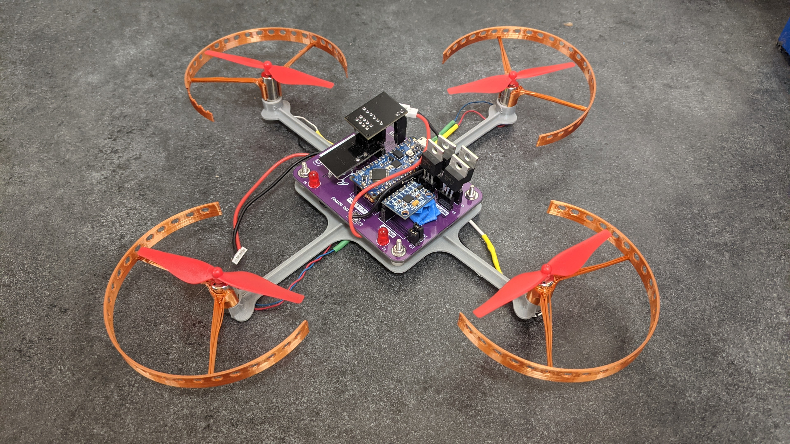

Demo showing the tilt-based motor control of the quadcopter that allows for the quadcopter to stabilize and balance ([full video](https://www.youtube.com/watch?v=k4_8MwJ_Zw4)):

## PCB Design
My original design used a perfboard, but I eventually designed a PCB that would not only simplify debugging and wire routing, but also allow for some weight reduction. The PCB takes into account many things such as the current that will flow from the LiPo batteries, the size of all the components, and more.

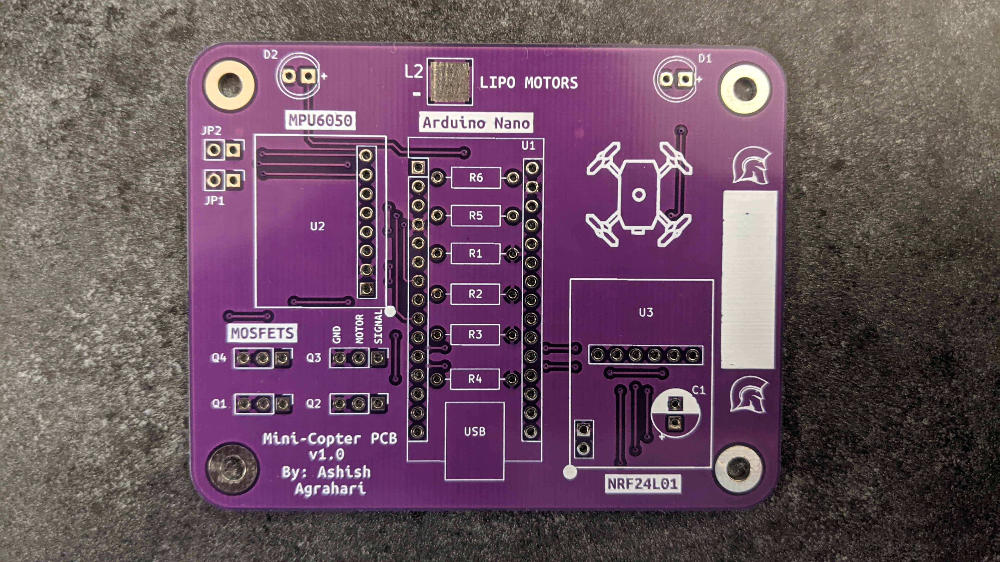
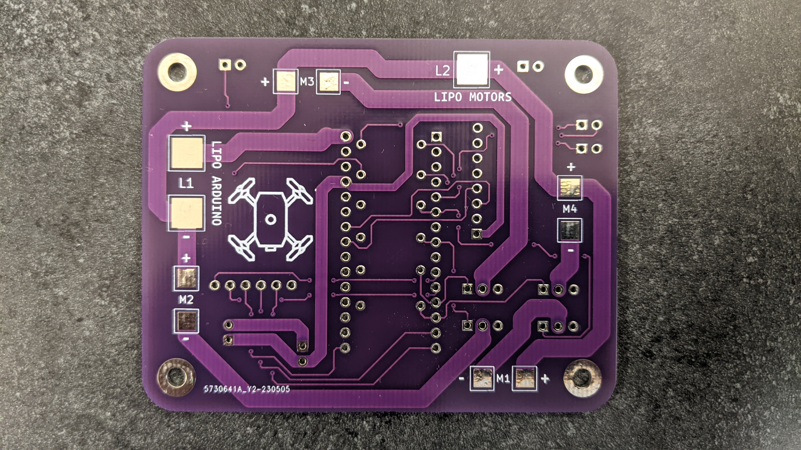
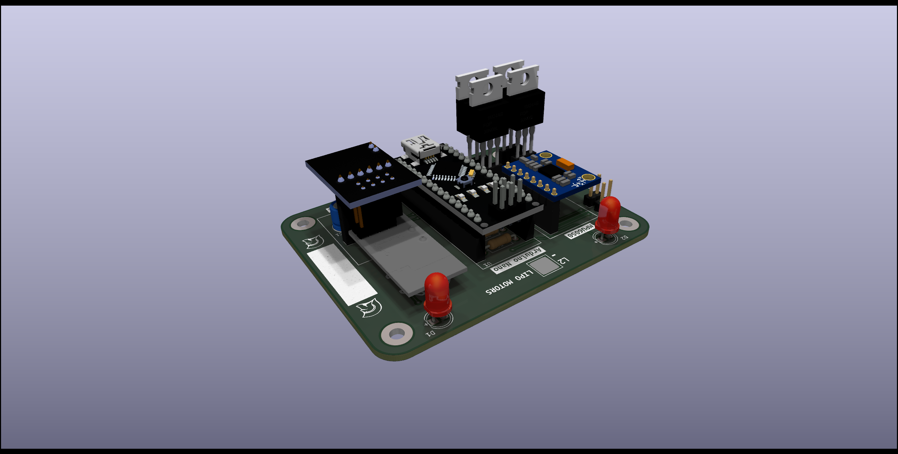

### Routing
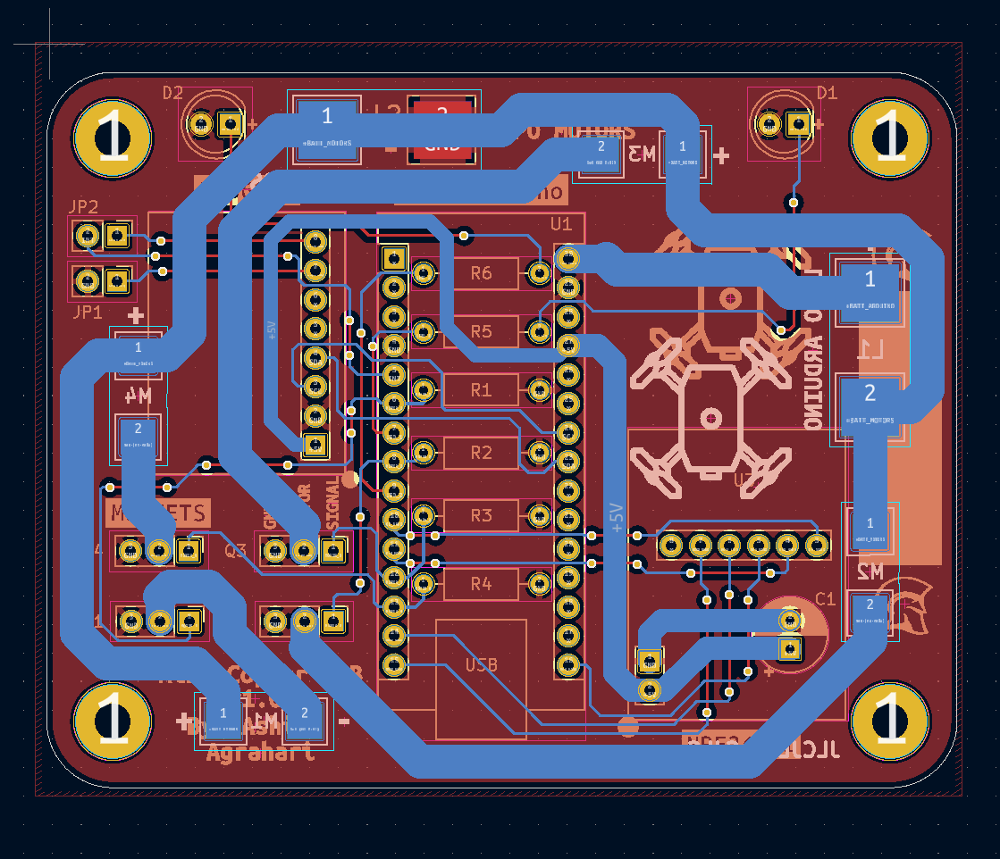
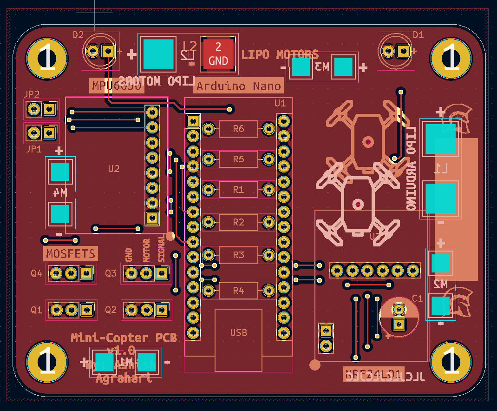
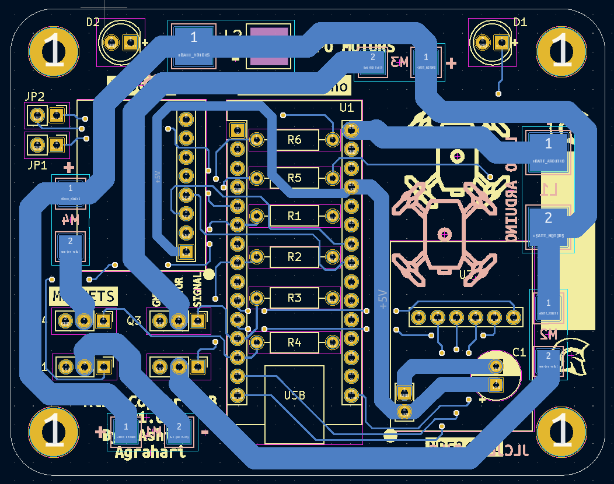

### Original Perfboard Design

| Perfboard Front Side | Perfboard Back Side |
| :---: | :---: |
|   | 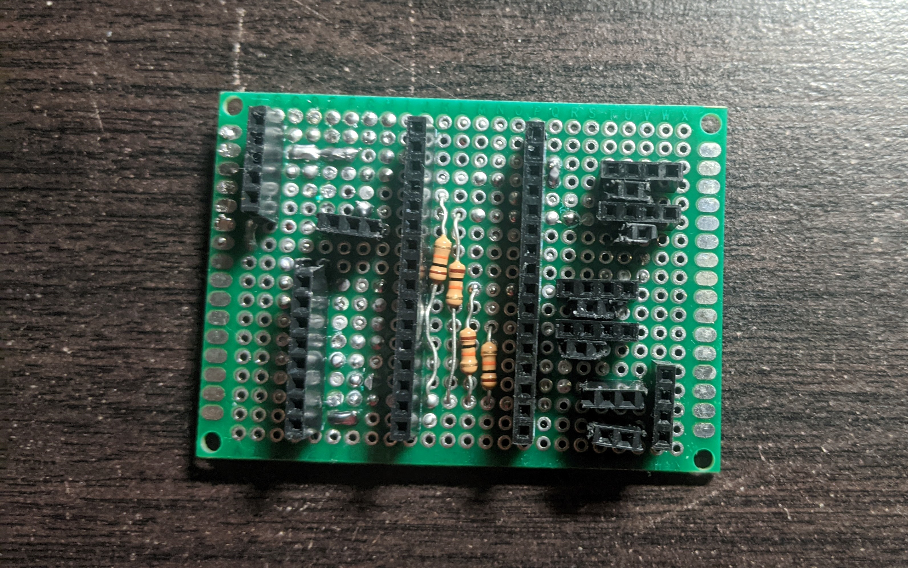 |
| Back side of complete perfboard | Perfboard on minicoptoper |
| 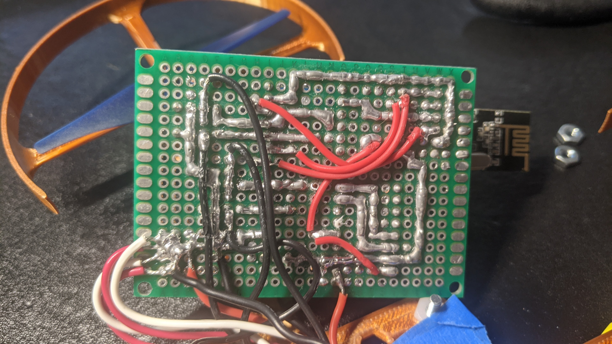  | 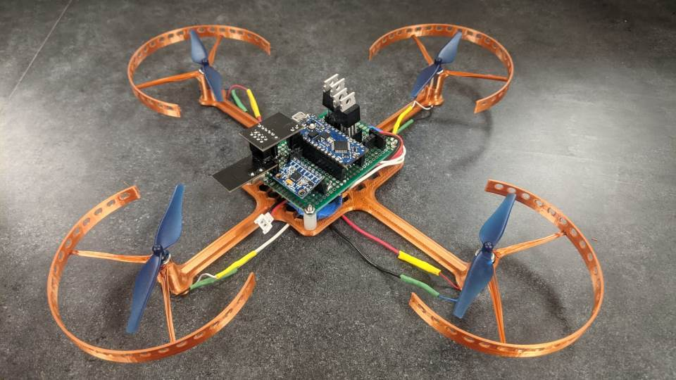 |

## Schematics
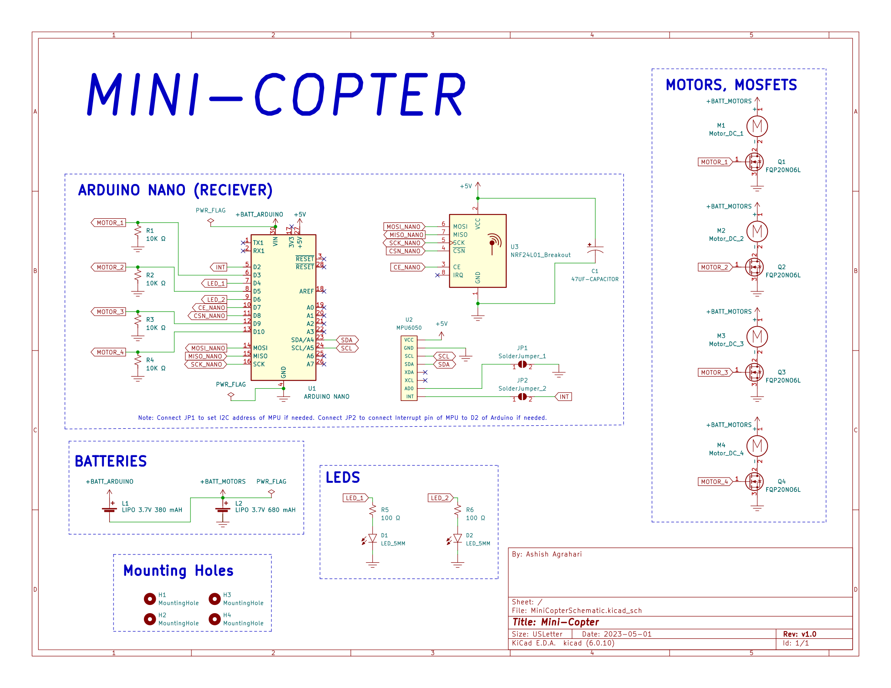
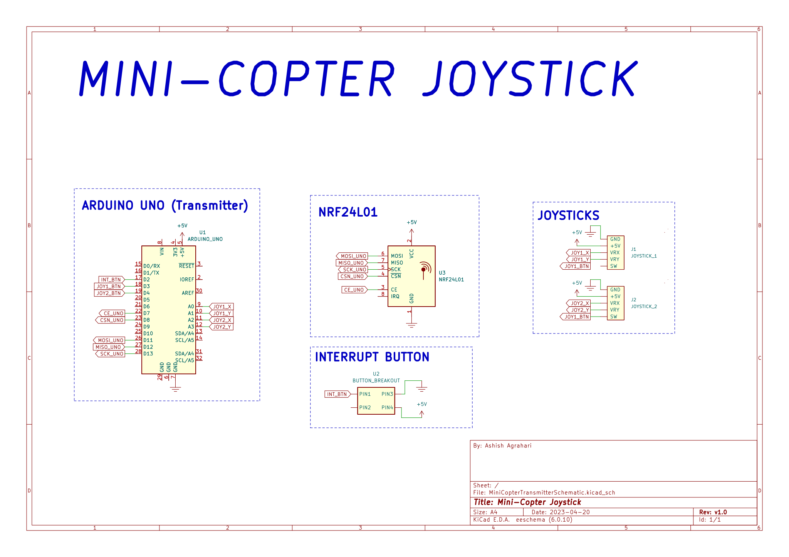

## Part Pictures
The main chassis has been built such that the frame is strong and firm enough, while reducing weight.
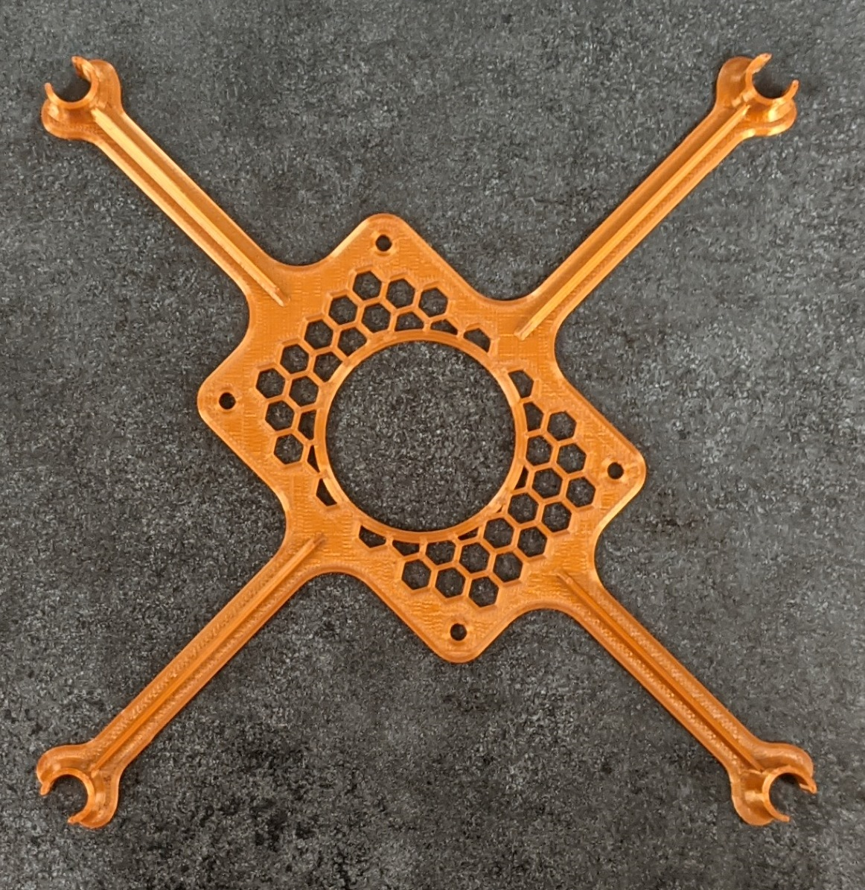
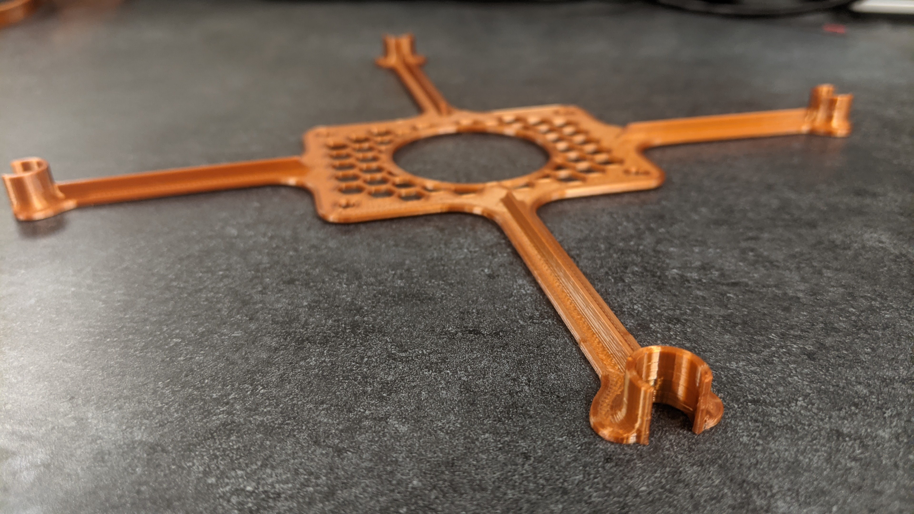
The propellor gaurds have also been designed such that it protects people and the quadcopter, while also being very lightweight.
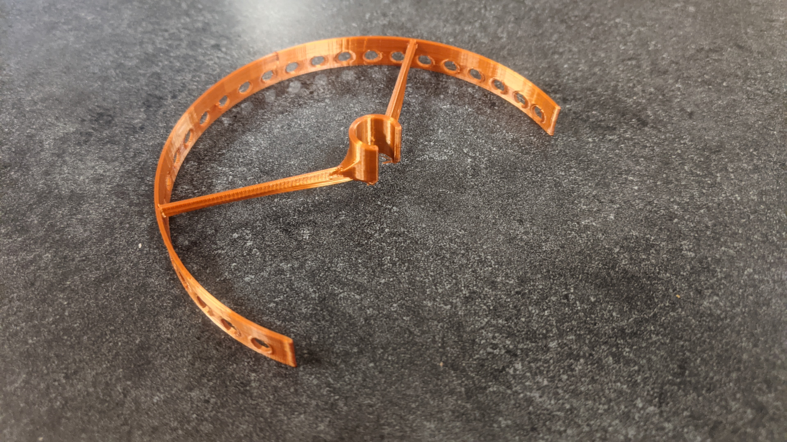

## Other Tests

Checkout some [flight testing](https://www.youtube.com/watch?v=XLUD_ImCz4A).

Checkout a demo of [the joystick wirelessly controlling a motor](https://www.youtube.com/watch?v=rh6yMr4QYGM).

To determine the strenght of each motor (how much each would be able to lift up), I 3D printed some parts and flipped the motor upside down:

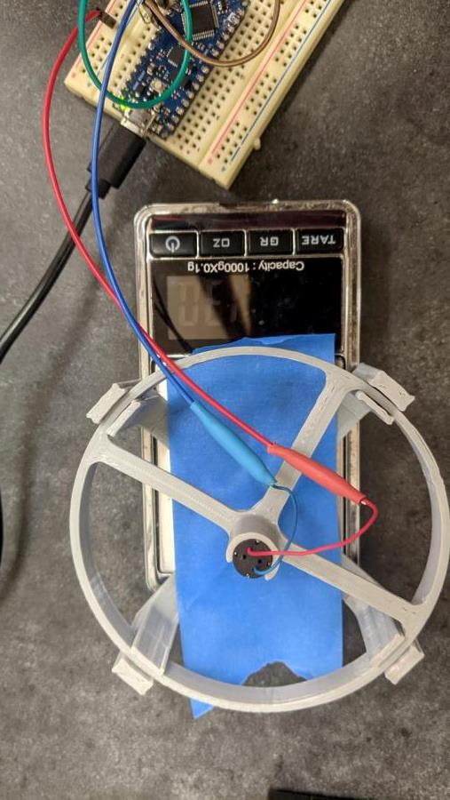

## Setup
- To open the schematics and pcb, install my [KiCAD libraries](https://github.com/AbhinavA10/kicad-libraries).