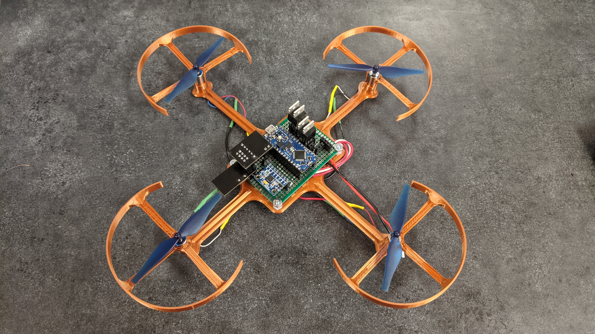
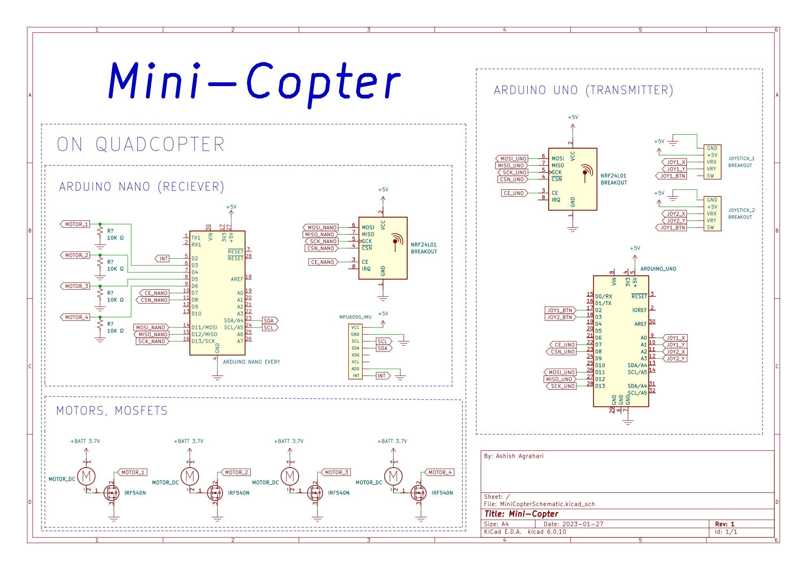

# MiniCopter
A mini quadcopter made completely from scratch using an Arduino Nano, an MPU6050 for orientation sensing, an NRF24L01 for wireless communication, MOSFETs that act as motor drivers, and 8520 Motors. It also uses a PID control loop in order to fly with stability. It is controlled using a custom transmitter that has 2 joysticks and an NRF24L01.

Programmed in `Arduino IDE`, models created in `Autodesk Inventor`, schematics created in `KiCad`.

More updates to come!

## Schematics

## Other Pictures
Unassembled 3D-printed parts:

Custom made perfboard:

Perfboard with motor wires soldered on (motor wires were initially meant to be connected using header pins on top of the board, but it was found that the end connectors of dupont wires had resistance and lowered the voltage going to the motors, thus wires had to be directly soldered on):

